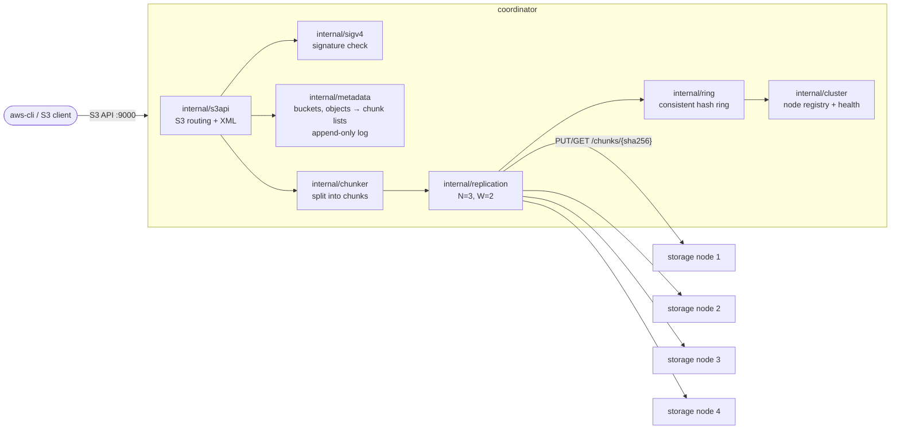
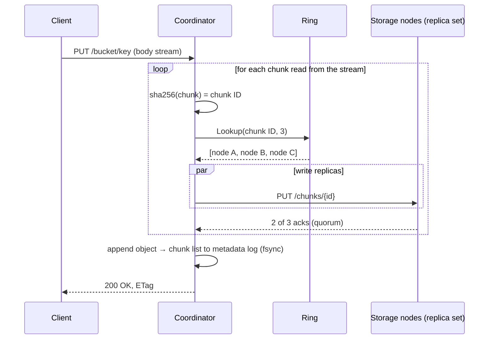

# mini-s3

A stdlib-only, S3-compatible distributed object store in Go, built from scratch to actually understand how object storage internals work: content-addressed chunking, consistent hashing with virtual nodes, replication with write quorums, an append-only metadata log, mark-and-sweep garbage collection, and re-replication after node failures. It speaks enough of the S3 protocol (path-style addressing, XML responses, SigV4 auth, multipart upload) to be driven by `aws-cli`.

No third-party libraries — just `net/http`, `encoding/xml`, `crypto/*`, `sync`, and `os`.

## Architecture

Clients only ever talk to the coordinator. The coordinator owns all metadata and decides where chunks live; storage nodes are dumb, content-addressed blob stores:

A `PutObject` writes every chunk to its replica set first and commits metadata last, so a crash can only ever leave orphan chunks (cleaned up by GC), never metadata pointing at missing data:

